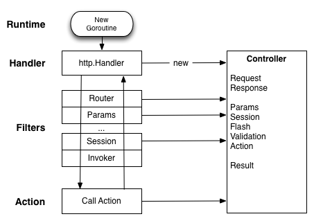

Revel is a batteries-included web framework in the spirit of Rails or Play!
Framework.  Many of the same (proven) ideas are incorporated in the framework
design and interface.

Revel makes it easy to build web applications using the Model-View-Controller
(MVC) pattern by relying on conventions that require a certain structure in your
application.  In return, it is very light on configuration and enables an
extremely fast development cycle.

## MVC

Here is a quick summary:

- *Models* are the essential data objects that describe your application domain.
   Models also contain domain-specific logic for querying and updating the data.
- *Views* describe how data is presented and manipulated. In our case, this is
   the template that is used to present data and controls to the user.
- *Controllers* handle the request execution.  They perform the user's desired
   action, they decide which View to display, and they prepare and provide the
   necessary data to the View for rendering.

There are many excellent overviews of MVC structure online.  In particular, the
one provided by [Play! Framework](http://www.playframework.org) matches our model exactly.

## Life of a Request

Here is an overview of the request processing framework.

Concept summary:

* Revel exposes a single http.Handler, responsible for instantiating the
  Controller (the context for the request) and passing the request along to the
  Filter Chain.
* Filters are links in a request processing chain. They may be composed to
  implement horizontal concerns like request logging, cookie policies,
  authorization, etc.  Most of the built-in functionality is implemented as
  Filters.
* Actions are the application-specific functions that process the input and
  produce a Result.

## HTTP Handler

Revel builds on top of the Go HTTP server, which creates a go-routine
(lightweight thread) to process each incoming request.  The implication is that
your code is free to block, but it must handle concurrent request processing.

The Revel handler does nothing except hand the request to the Filter chain for
processing and, upon completion, apply the result to write the response.

By default, the Revel handler will be registered on `"/"` to receive all
incoming connections.  However, applications are free to override this behavior
-- for example, they may want to use existing http.Handlers rather than
re-implementing them within the Revel framework.  See the [FAQ](faq.html) for
more detail.

## Filters

[Filters](filters.html) implement most request processing functionality provided
by Revel. They have a simple interface that allows them to be nested.

The "Filter Chain" is an array of functions, each one invoking the next, until
the terminal filter stage invokes the action.  For example, one of the first
Filters in the chain is the `RouterFilter`, which decides which Action the
request is meant for and saves that to the Controller.

Overall, Filters and the Filter Chain are the equivalent of Rack.

## Controllers and Actions

Each HTTP request invokes an **action**, which handles the request and writes
the response. Related **actions** are grouped into **controllers**.  The
[Controller](../docs/godoc/controller.html#Controller) type contains relevant
fields and methods and acts as the context for each request.

As part of handling a HTTP request, Revel instantiates an instance of your
Controller, and it sets all of these properties on the embedded
`revel.Controller`.  Revel does not share Controller instances between requests.

***

A **Controller** is any type that embeds `*revel.Controller` (directly or indirectly).

<pre class="prettyprint lang-go">
type AppController struct {
  *revel.Controller
}
</pre>


An **Action** is any method on a **Controller** that meets the following criteria:
* is exported
* returns a revel.Result

For example:

<pre class="prettyprint lang-go">
func (c AppController) ShowLogin(username string) revel.Result {
	..
	return c.Render(username)
}
</pre>


The example invokes `revel.Controller.Render` to execute a template, passing it the
username as a parameter.  There are many methods on **revel.Controller** that
produce **revel.Result**, but applications are also free to create their own.

## Results

A Result is anything conforming to the interface:

<pre class="prettyprint lang-go">
type Result interface {
	Apply(req *Request, resp *Response)
}
</pre>

Typically, nothing is written to the response until the **action** and all
filters have returned.  At that point, Revel writes response headers and cookies
(e.g. setting the session cookie), and then invokes `Result.Apply` to write the
actual response content.
