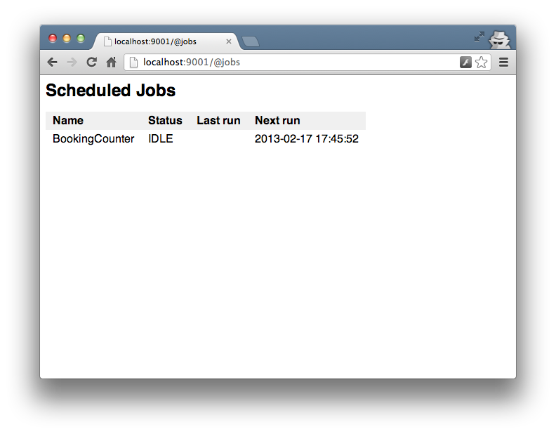

Revel provides a framework for performing work asynchronously, outside of the
request flow.  This may take the form of recurring tasks that update cached data
or one-off tasks for sending emails.

## Activation

The framework is included as an optional module, that is not included in your
application by default.  To activate it, add the module to your app
configuration:

	module.jobs = github.com/robfig/revel/modules/jobs

Additionally, in order to access the job monitoring page, you will need to add
this line to your routes:

	module:jobs

This statement will insert the `/@jobs` route at that location.

## Options

There are a couple of options that tell the framework what sort of limitations
to place on the jobs that it runs.

This example shows them set to their default values.

    jobs.pool = 10                # Number of jobs allowed to run simultaneously
    jobs.selfconcurrent = false   # Allow a job to run only if previous instances are done

## Startup jobs

To run a task on application startup, use
[`revel.OnAppStart`](../docs/godoc/init.html#OnAppStart) to register a function.
Revel runs these tasks serially, before starting the server.  Note that this
functionality does not actually use the jobs module, but it can be used to
submit a job for execution that doesn't block server startup.


<pre class="prettyprint lang-go">
func init() {
    revel.OnAppStart(func() { jobs.Now(populateCache{}) })
}
</pre>


## Recurring jobs

Jobs may be scheduled to run on any schedule.  There are two options for expressing the schedule:

1. A cron specification
2. A fixed interval

Revel uses the [cron library](https://github.com/robfig/cron) to parse the
schedule and run the jobs.  The library's
[README](https://github.com/robfig/cron/blob/master/README.md) provides a detailed
description of the format accepted.

Jobs are generally registered using the
[`revel.OnAppStart`](../docs/godoc/init.html#OnAppStart) hook, but they may be
registered at any later time as well.

Here are some examples:


<pre class="prettyprint lang-go">
import (
    "github.com/robfig/revel"
    "github.com/robfig/revel/modules/jobs/app/jobs"
    "time"
)

type ReminderEmails struct {
    // filtered
}

func (e ReminderEmails) Run() {
    // Queries the DB
    // Sends some email
}

func init() {
    revel.OnAppStart(func() {
        jobs.Schedule("0 0 0 * * ?",  ReminderEmails{})
        jobs.Schedule("@midnight",    ReminderEmails{})
        jobs.Schedule("@every 24h",   ReminderEmails{})
        jobs.Every(24 * time.Hour,    ReminderEmails{})
    })
}
</pre>


## Named schedules

You can configure schedules in your `app.conf` file and reference them anywhere.
This can help provide easy reuse and a useful description for crontab specs.

To define your named cron schedule, put this in your `app.conf`:

    cron.workhours_15m = 0 */15 9-17 ? * MON-FRI

Use the named schedule by referencing it anywhere you would have used a
cron spec.


<pre class="prettyprint lang-go">
func init() {
    revel.OnAppStart(func() {
        jobs.Schedule("cron.workhours_15m", ReminderEmails{})
    })
}
</pre>


> Note: Your cron schedule name must begin with "cron."

## One-off jobs

Sometimes you will want to do something in response to a user action.  In these
cases, the jobs module allows you to submit a job to be run a single time.

The only control offered is how long to wait until the job should be run.


<pre class="prettyprint lang-go">
type AppController struct { *revel.Controller }

func (c AppController) Action() revel.Result {
    // Handle the request.
    ...

    // Send them email asynchronously, right now.
    jobs.Now(SendConfirmationEmail{})

    // Or, send them email asynchronously after a minute.
    jobs.In(time.Minute, SendConfirmationEmail{})
}
</pre>


## Registering functions

It is possible to register a `func()` as a job by wrapping it in the `jobs.Func`
type.  For example:


<pre class="prettyprint lang-go">
func sendReminderEmails() {
    // Query the DB
    // Send some email
}

func init() {
    revel.OnAppStart(func() {
        jobs.Schedule("@midnight", jobs.Func(sendReminderEmails))
    })
}
</pre>


## Job Status

The jobs module provides a status page that shows a list of the scheduled jobs
it knows about, their current status (**IDLE** or **RUNNING**), and their
previous and next run times.

For security purposes, the status page is restricted to requests that originate
from 127.0.0.1.

## Constrained pool size

It is possible to configure the job module to limit the number of jobs that are
allowed to run at the same time.  This allows the developer to restrict the
resources that could be potentially in use by asynchronous jobs -- typically
interactive responsiveness if valued above asynchronous processing.  When a pool
is full of running jobs, new jobs block to wait for running jobs to complete.

Implementation note: The implementation blocks on a channel receive, which is
implemented to be FIFO for waiting goroutines (but not specified/required to be
so). [See here for discussion](https://groups.google.com/forum/?fromgroups=#!topic/golang-nuts/CPwv8WlqKag).

## Areas for development

* Allow access to the job status page with HTTP Basic Authentication credentials
* Allow administrators to run scheduled jobs interactively from the status page
* Provide more visibility into the job runner, e.g. the pool size, the job queue length, etc.
