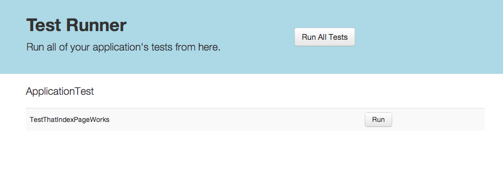
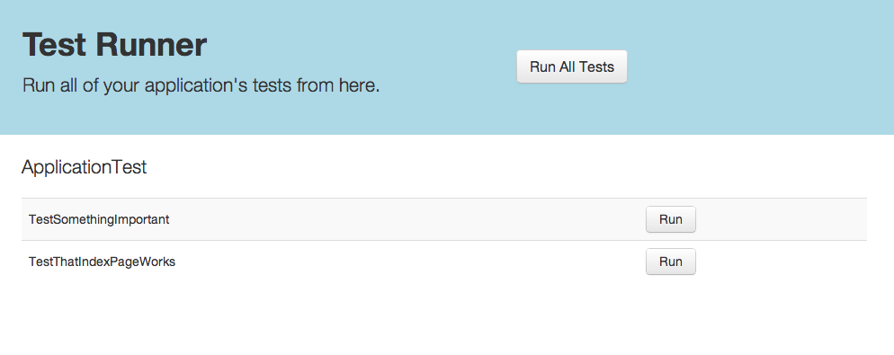
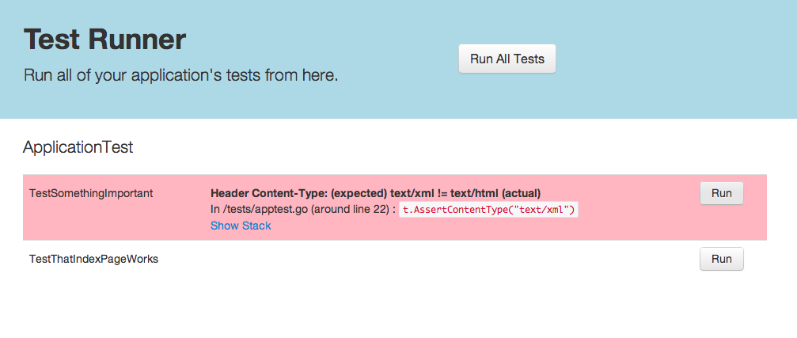
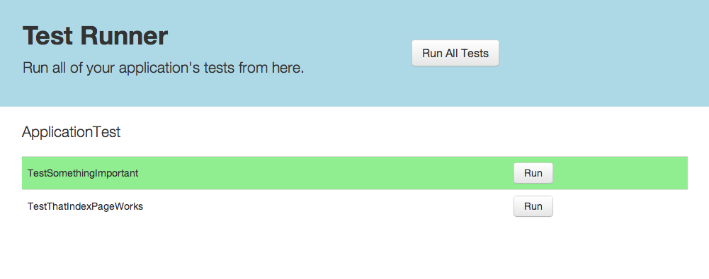

Revel provides a testing framework that makes it easy to write and run functional tests against your application.

The skeleton app comes with a simple test to use as a starting point.

## Overview

Tests are kept in the tests directory:

	corp/myapp
		app/
		conf/
		public/
		tests/    <----

A simple test looks like the following:

<pre class="prettyprint lang-go">
type AppTest struct {
  revel.TestSuite
}

func (t *AppTest) Before() {
	println("Set up")
}

func (t *AppTest) TestThatIndexPageWorks() {
	t.Get("/")
	t.AssertOk()
	t.AssertContentType("text/html")
}

func (t *AppTest) After() {
	println("Tear down")
}
</pre>

The example code above shows a couple things:

* A test suite is any struct that embeds `revel.TestSuite`
* `Before()` and `After()` are invoked before and after every test method, if present.
* The `revel.TestSuite` provides helpers for issuing requests to your application and for asserting things about the response.
* An assertion failure generates a panic, which is caught by the test harness.

You may run this test in two ways:

* Interactively, from your web browser, useful during test development.
* Non-interactively, from the command line, useful for integrating with a continuous build.

## Developing a test suite

To create your own test suite, define a struct that embeds `revel.TestSuite`, which provides a HTTP client and a number of helper methods for making requests to your application.

<pre class="prettyprint lang-go">
type TestSuite struct {
	Client       *http.Client
	Response     *http.Response
	ResponseBody []byte
}

// Some request methods
func (t *TestSuite) Get(path string)
func (t *TestSuite) Post(path string, contentType string, reader io.Reader)
func (t *TestSuite) PostForm(path string, data url.Values)
func (t *TestSuite) MakeRequest(req *http.Request)

// Some assertion methods
func (t *TestSuite) AssertOk()
func (t *TestSuite) AssertContentType(contentType string)
func (t *TestSuite) Assert(exp bool)
func (t *TestSuite) Assertf(exp bool, formatStr string, args ...interface{})
</pre>

[See the godoc here](../docs/godoc/tests.html)

All request methods behave similarly:

1. They accept a path (e.g. `/users/`)
2. They issue the request to the app server
3. They store the response in the `Response` member.
4. They read the full response body into the `ResponseBody` member.

If the developer wishes to use a customized HTTP Client instead of the default [http.DefaultClient](http://golang.org/pkg/net/http/#pkg-variables), they should replace it in the `Before()` method.

All assertions raise a panic if they are not fulfilled.  All panics are caught by the test harness and presented as errors.

## Running a test suite

In order to run any tests, the `testrunner` module must be activated.  This is done by including the following line in your `app.conf`:

	module.testrunner = github.com/robfig/revel/modules/testrunner
	
You must also import the test module routes, by adding this line to your `routes` file:

	module:testrunner

With that done, the tests may be run interactively or non-interactively.

### Running tests interactively

To take advantage of Revel's hot-compile functionality, an interactive test runner is provided for quick edit-refresh cycles.

For example, the developer loads `/@tests` in their browser:

Then they add a test method:

<pre class="prettyprint lang-go">
func (t AppTest) TestSomethingImportant() {
	t.Get("/")
	t.AssertOk()
	t.AssertContentType("text/xml")
}
</pre>

Then they refresh their browser to see their new test:

They run the test:

Uh oh.  It doesn't work.  They fix the code to expect a content type of "text/html" instead of "text/xml":

<pre class="prettyprint lang-go">
	t.AssertContentType("text/html")
</pre>

Then they re-run the test:

Success.

### Running tests non-interactively

The Revel [command line tool](tool.html) provides a `test` command that allows all application tests to be run from the command line.

Here is an example session:

	$ revel test github.com/robfig/revel/samples/booking dev
	~
	~ revel! http://robfig.github.com/revel
	~
	INFO  2012/11/09 19:21:02 revel.go:237: Loaded module testrunner
	Open DB
	Listening on port 9000...
	INFO  2012/11/09 19:21:06 test.go:95: Testing Booking example (github.com/robfig/revel/samples/booking) in dev mode
	Go to /@tests to run the tests.

	1 test suite to run.

	AppTest                 PASSED        0s

	All Tests Passed.

You can also run a single test suite, or method within that suite, with a period-separated parameter:

	$ revel test github.com/robfig/revel/samples/booking dev ApplicationTest
	$ revel test github.com/robfig/revel/samples/booking dev ApplicationTest.TestThatIndexPageWorks

In the console only a simple PASSED/FAILED overview by test suite is displayed.  The tool writes more detailed results to the filesystem:

	$ cd src/github.com/robfig/revel/samples/booking
	$ find test-results
	test-results
	test-results/app.log
	test-results/AppTest.passed.html
	test-results/result.passed

It writes three different things:

1. The application's stdout and stderr are redirected to `app.log`
2. One HTML file per test suite is written, describing the tests that passed or failed.
3. Either `result.passed` or `result.failed` is written, depending on the overall success.

There are two suggested mechanisms for integrating this into a continuous build:

1. Check the return code, which is 0 for a successful test run and non-zero otherwise.
2. Require the presence of `result.success` after the run, or disallow the presence of `result.failed`.

## Implementation notes

What Revel does is:

* Scan the test source code for types that (transitively) embed TestSuite
* Set the `revel.TestSuites` variable to a list of those types in the generated main.go file.
* On demand, uses reflection to find all methods beginning with "Test" on the TestSuite types, and invokes them to run the test.
* Catches panics from bugs or failed assertions and displays the error helpfully.

Testing code is only built when the special `testrunner` module is activated.

## Areas for development

The testing framework could use the following improvements:

* Fixtures for populating a datastore with test data.
* Loggers that write to a file (instead of stderr / stdout) should also be redirected to `test-results/app.log`
