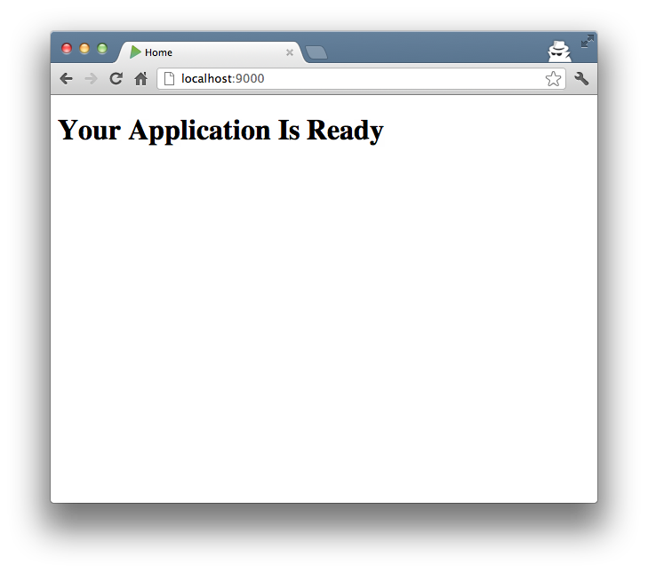

Use the Revel command line tool to create an empty project in your GOPATH and
run it:

	$ cd $GOPATH

	$ revel new myapp
	~
	~ revel! http://robfig.github.com/revel
	~
    Your application is ready:
        /Users/robfig/code/gocode/src/myapp

    You can run it with:
        revel run myapp

	$ revel run myapp
	~
	~ revel! http://robfig.github.com/revel
	~
	2012/09/27 17:01:54 run.go:41: Running myapp (myapp) in dev mode
	2012/09/27 17:01:54 harness.go:112: Listening on :9000

Open your browser to http://localhost:9000/ to see a notification that your app
is ready.

The generated project structure is described
[here](../manual/organization.html).

**Next: [Learn how Revel handles requests.](requestflow.html)**
