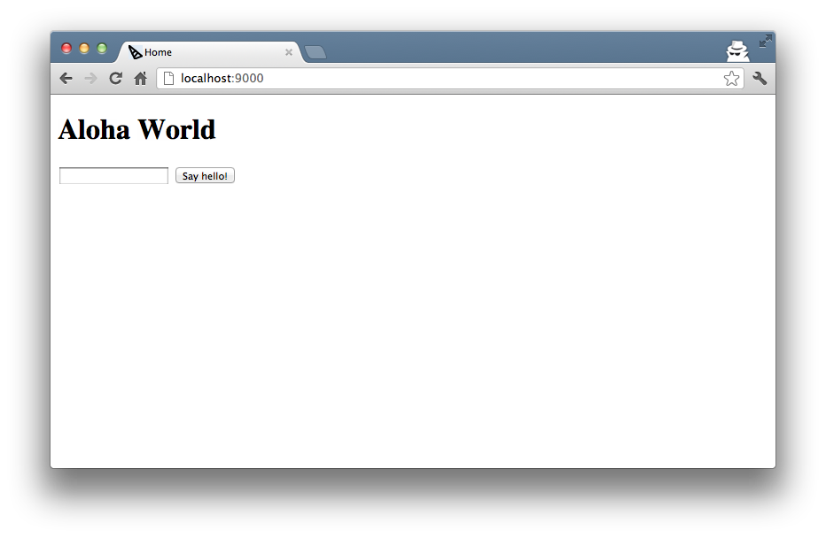
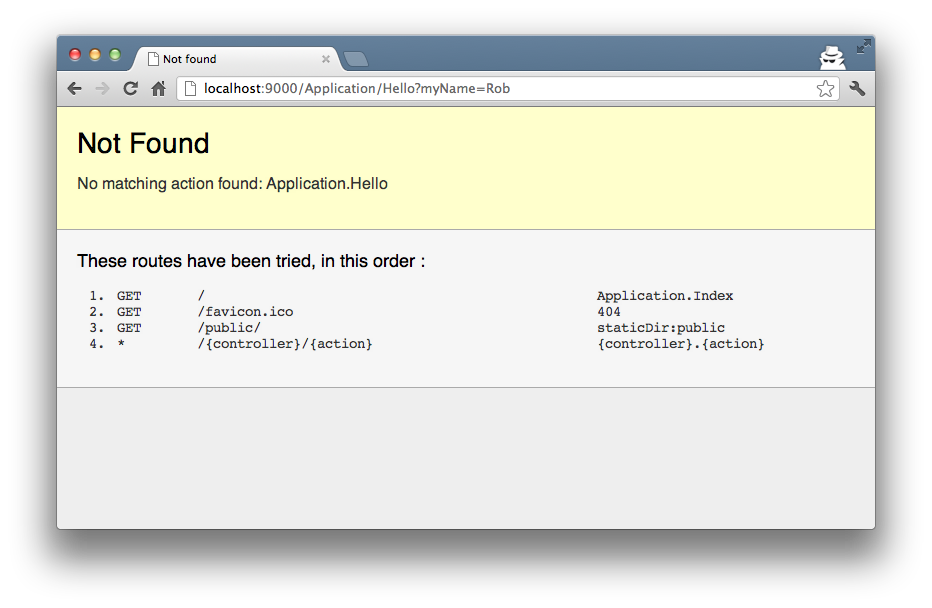
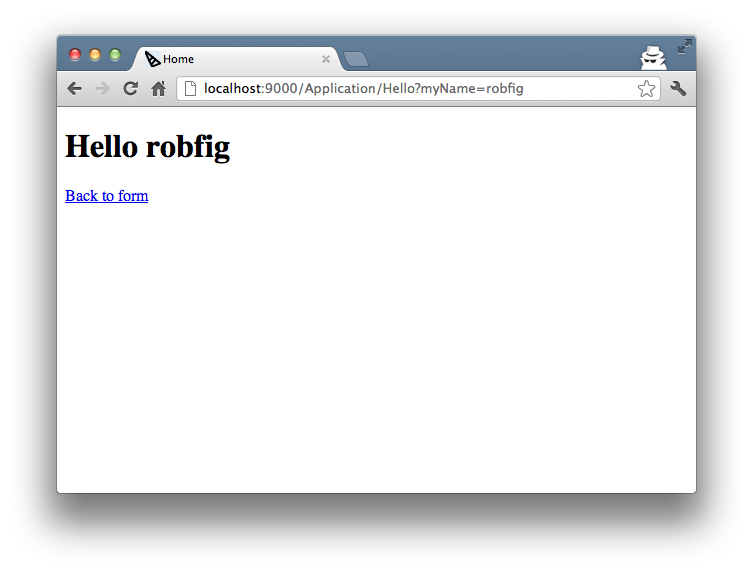
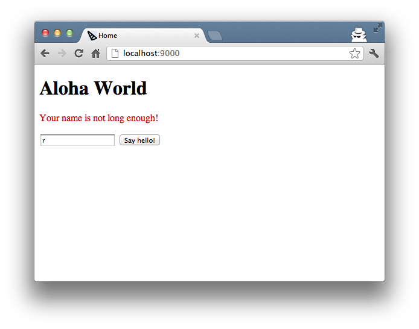

This article runs through the quick exercise of implementing the "Hello World"
application from
[the Play! example](http://www.playframework.org/documentation/1.2.4/firstapp).

Let's start with the **myapp** project that [we created previously](createapp.html).

Edit the **app/views/App/Index.html** template to add this form, under the
included `flash.html` template:

	<form action="/App/Hello" method="GET">
	    <input type="text" name="myName" /> 
	    <input type="submit" value="Say hello!" />
	</form>

Refresh the page to see our work.

Let's try submitting that form.

That makes sense.  Add the action to **app/controllers/app.go**:

	func (c App) Hello(myName string) revel.Result {
		return c.Render(myName)
	}

Next, we have to create the view.  Create a file
**app/views/App/Hello.html**, with this content:


	{{set . "title" "Home"}}
	{{template "header.html" .}}

	<h1>Hello {{.myName}}</h1>
	<a href="/">Back to form</a>

	{{template "footer.html" .}}


Refresh the page, and you should see a greeting:

Lastly, let's add some validation.  The name should be required, and at least
three characters.

To do this, let's use the [validation module](../manual/validation.html).  Edit
your action in **app/controllers/app.go**:

	func (c App) Hello(myName string) revel.Result {
		c.Validation.Required(myName).Message("Your name is required!")
		c.Validation.MinSize(myName, 3).Message("Your name is not long enough!")

		if c.Validation.HasErrors() {
			c.Validation.Keep()
			c.FlashParams()
			return c.Redirect(App.Index)
		}

		return c.Render(myName)
	}

Now it will send the user back to `Index()` if they have not entered a valid
name. Their name and the validation error are kept in the
[Flash](../manual/sessionflash.html), which is a temporary cookie.

The provided `flash.html` template will show any errors or flash messages:


	{{if .flash.success}}
	

		{{.flash.success}}
	

	{{end}}

	{{if or .errors .flash.error}}
	

		{{if .flash.error}}
			{{.flash.error}}
		{{end}}
		{{if .errors}}
		<ul style="margin-top:10px;">
			{{range .errors}}
				<li>{{.}}</li>
			{{end}}
		</ul>
		{{end}}
	

	{{end}}


When we submit that form with a name that fails validation, we want the form to retain the bad name, so that the user can edit it before re-submitting.  Amend the form you had added to your **app/views/App/Index.html** template:

	<form action="/App/Hello" method="GET">
		{{with $field := field "myName" .}}
			<input type="text" name="{{$field.Name}}" value="{{$field.Flash}}"/> 
		{{end}}
		<input type="submit" value="Say hello!" />
	</form>
	
Now when we submit a single letter as our name:

Success, we got an appropriate error and our input was saved for us to edit.
